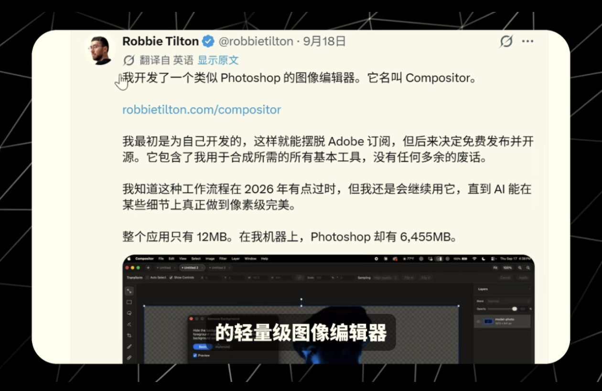

# Compositor — 轻量级图像编辑器

> 一个类似 Photoshop 的图像编辑器，仅 12MB，免费开源。



## 项目信息

| 项目 | 详情 |
|------|------|
| 名称 | Compositor |
| 作者 | Robbie Tilton / Wonder Assembly LLC |
| 官网 | [robbietilton.com/compositor](https://robbietilton.com/compositor) |
| 原仓库 | [github.com/robbietilton/Compositor](https://github.com/robbietilton/Compositor) |
| 许可证 | MIT License |
| 当前版本 | v1.4.8 |

## 为什么用它

- **超轻量**：整个应用只有 12MB（Photoshop 约 6.5GB）
- **免费开源**：MIT 协议，无订阅，无广告
- **够用就好**：包含合成所需的基本工具，没有多余功能
- **原生体验**：Mac 原生应用，启动快、占资源少

## 适用场景

- 日常图片合成、修图
- 简单的图层操作
- 不想为了偶尔用一次就开 Photoshop
- 摆脱 Adobe 订阅

## 目录结构

```
compositor/
├── README.md              # 本文件 — 软件说明
├── installer/             # 安装包目录
│   └── macos/
│       └── Compositor.dmg # macOS 安装包
└── assets/                # 相关资源
    └── intro-screenshot.png
```

## 安装说明

### macOS

1. 打开 `installer/macos/Compositor.dmg`
2. 将 Compositor 拖拽到 Applications 文件夹
3. 从启动台或 Applications 中打开

> 首次打开如果提示"无法打开"，请在「系统设置 → 隐私与安全性」中点击"仍要打开"。

## 平台支持

| 平台 | 支持状态 |
|------|----------|
| macOS | ✅ 官方支持 |
| Windows | ❌ 暂无 |
| Linux | ❌ 暂无 |

## 相关链接

- [官方网站](https://robbietilton.com/compositor)
- [GitHub 源码仓库](https://github.com/robbietilton/Compositor)
- [最新 Release](https://github.com/robbietilton/Compositor/releases/latest)

## 许可证

本软件基于 MIT License 开源，版权归 Wonder Assembly LLC 所有。
本仓库仅作个人备份与学习使用，软件版权归原作者所有。
